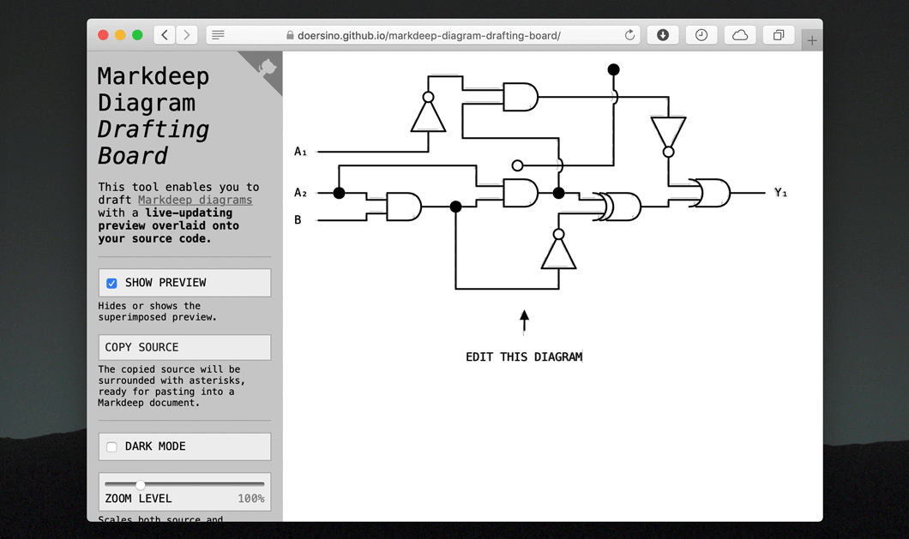

# markdeep-diagram-drafting-board

*Draft Markdeep diagrams with a live-updating preview overlaid onto your source code.*

**Try it out here: https://doersino.github.io/markdeep-diagram-drafting-board/**

Your source and settings are continually written to local storage, so – barring browser bugs – they will be restored when you close and reopen the page. Your data isn't sent anywhere else.

*With minor changes, you can use this tool to make generative art – see [this Gist](https://gist.github.com/doersino/5384a304ec51e86f3d7fd8566dcf11d6) for the code and instructions, and [this Twitter thread](https://twitter.com/doersino/status/1321191553403129857) for examples.*
